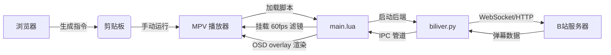

# Biliver 项目实现逻辑与方法说明

本文档详细描述了 Biliver 插件的架构和实现细节，为开发者或 AI 助手提供深度理解。

## 1. 整体架构

Biliver 采用 **前端解析 → 指令传递 → Lua 播放器逻辑 → Python 后端 → OSD 渲染** 的闭环架构。

```
┌──────────────┐    指令     ┌────────────┐    IPC     ┌──────────────┐
│  油猴脚本     │ ────────►  │  main.lua   │ ────────► │  biliver.py   │
│ biliver.js   │            │  (Lua/MPV)  │           │  (Python)     │
└──────────────┘            └──────┬─────┘           └──────┬───────┘
                                   │                        │
                                   │  OSD overlay           │  WebSocket / HTTP
                                   │  (零闪烁 60fps)         │  (弹幕数据)
                                   ▼                        ▼
                              ┌────────────┐           ┌──────────────┐
                              │   MPV      │           │ Bilibili API │
                              │  播放器     │           │  WebSocket   │
                              └────────────┘           └──────────────┘
```

### 组件职责

| 组件 | 文件 | 职责 |
| :--- | :--- | :--- |
| **前端** | `biliver.js` (油猴脚本) | 从 B 站页面提取播放 URL、CID/房间号、Cookie，生成 MPV 启动指令 |
| **Lua 逻辑** | `main.lua` | 弹幕 OSD 渲染、60fps 补帧、Python 后端进程管理、IPC 通信 |
| **Python 后端** | `biliver.py` | 弹幕协议解析 (WebSocket)、VOD 弹幕下载、轨道碰撞计算、IPC 消息发送 |
| **用户配置** | `biliver.conf` | 字体、大小、透明度、速度、显示区域等参数 |

---

## 2. 前端解析层 (`biliver.js`)

### 核心逻辑
- **SPA 适配**: 通过 `History API` 钩子 + `setInterval` 轮询检测 B 站 URL 变化
- **按需显示**: 仅在有效视频/直播页面且 API 返回 `aid/cid` 后显示启动按钮
- **CDN 提取**: 
  - 点播: 获取 DASH 流（音画分离，支持高码率/4K/HDR）
  - 直播: 解析 `playUrl` 接口，提取原画直播流
- **防 403**: 指令包含 `Origin` 和 `Referer` 头，B 站 CDN 强制校验
- **状态注入**: `biliver_enabled=yes`、`cid`/`biliver_room_id`、`--start` (同步进度)

---

## 3. 弹幕渲染层 (`main.lua`)

### 3.1 直播弹幕渲染（核心）

使用 **`mp.create_osd_overlay("ass-events")`** 实现零闪烁渲染：

```
┌─────────────────────────────────────────────────────┐
│  overlay (OSD 覆盖层)                                │
│  ┌───────────────────────────────────────────────┐  │
│  │ {\an7\pos(1764,10)\c&HFFFFFF&\bord0\shad0...} │  ← 弹幕1
│  │ {\an7\pos(1452,54)\c&HFF0000&\bord0\shad0...} │  ← 弹幕2
│  │ {\an7\pos(1140,98)\c&H00FF00&\bord0\shad0...} │  ← 弹幕3
│  └───────────────────────────────────────────────┘  │
│  每行 = 一个独立 ASS 事件，\pos 各自独立              │
└─────────────────────────────────────────────────────┘
```

**关键特性：**
- **零闪烁**: `overlay:update()` 原子替换整个覆盖层内容，无字幕轨道切换
- **60fps 平滑**: `mp.add_timeout(0, render_frame)` 链式调用，每帧计算所有弹幕位置
- **单调时钟**: `mp.get_time()` 驱动动画，消除 `time-pos` 在直播中的不稳定性
- **无边框/阴影**: `\bord0\shad0` 实现极简视觉
- **独立定位**: `\n` 分隔每行，每行是独立 ASS 事件，`\pos` 互不干扰

### 3.2 渲染流程

```
add_danmaku(color, text, y_hint)
    │
    ├─► pick_track(text_width)       ← 轨道分配（碰撞检测）
    │       │
    │       ├─ 空闲车道 → 立即使用
    │       └─ 全部忙碌 → 排队等待（effective_start 延迟入画）
    │
    ├─► 创建弹幕对象存入 dm_pool
    │       born = effective_start    ← 实际开始时间（可能延迟）
    │       lifespan = o.duration     ← 生命周期
    │       start_x = live_w          ← 起始位置（右边缘）
    │       end_x = -1200             ← 结束位置（左边缘外）
    │
    └─► start_render()
            │
            └─► mp.add_timeout(0, render_frame)  ← 60fps 渲染循环
                    │
                    ├─► now = mp.get_time()
                    ├─► 清理过期弹幕 (now - born > lifespan)
                    ├─► 计算每条弹幕 x = start_x - speed * elapsed
                    ├─► 构建 ASS 字符串（\n 分隔）
                    └─► overlay:update()           ← 原子替换
```

### 3.3 轨道分配算法 (`pick_track`)

```lua
local function pick_track(text_width)
    local now = mp.get_time()
    local travel_time = text_width / danmaku_speed + 0.2  -- 通过时间 + 安全余量
    
    -- 1. 优先使用空闲车道
    for i = 1, max_tracks do
        if now >= (track_until[i] or 0) then
            track_until[i] = now + travel_time
            return i, now  -- 立即开始
        end
    end
    
    -- 2. 全部忙碌时，选最早空闲的车道并排队
    local best = 1
    for i = 2, max_tracks do
        if (track_until[i] or 0) < (track_until[best] or 0) then
            best = i
        end
    end
    local effective_start = (track_until[best] or now)  -- 排队等待
    track_until[best] = effective_start + travel_time
    return best, effective_start  -- 延迟开始
end
```

**排队机制**: 当所有车道忙碌时，新弹幕的 `born` 时间被设为 `effective_start`（前车移走的时间）。在等待期间 `elapsed = now - born < 0`，弹幕停在右边缘外（不可见），直到车道空闲才开始移动。这**彻底消除了重叠**。

### 3.4 60fps 补帧滤镜

```lua
-- 低于 59fps 的视频自动挂载 fps=60 补帧滤镜
mp.commandv('vf', 'append', '@Biliver-FPS:fps=fps=60:round=near')
```

确保即使 24fps 视频，弹幕也能以 60fps 物理刷新率平滑移动。

### 3.5 弹幕样式

每条弹幕的 ASS 标签格式：
```
{\an7\pos(x,y)\c&HBBGGRR&\bord0\shad0\fs<size>\fn<font>\alpha&H<alpha>&}text
```

| 标签 | 作用 |
| :--- | :--- |
| `\an7` | 对齐方式：左上角 |
| `\pos(x,y)` | 位置（每帧动态计算） |
| `\c&HBBGGRR&` | 文字颜色（来自 B 站用户等级） |
| `\bord0` | 无边框 |
| `\shad0` | 无阴影 |
| `\fs<size>` | 字体大小（用户配置） |
| `\fn<font>` | 字体名称（用户配置） |
| `\alpha&H<alpha>&` | 透明度（用户配置） |

### 3.6 快捷键

| 快捷键 | 功能 |
| :--- | :--- |
| `Ctrl+D` | 切换弹幕显示/隐藏（通过 `overlay.hidden` 属性） |

---

## 4. Python 后端 (`biliver.py`)

### 4.1 直播模式 (`run_live`)

- **WebSocket 连接**: 连接 Bilibili 直播弹幕服务器
- **Protobuf 解析**: 处理 Brotli 压缩的弹幕包
- **颜色转换**: `&H{B}{G}{R}&` 格式（ASS 兼容）
- **IPC 通信**: 通过命名管道 (Windows) / Unix Socket 发送 `script-message biliver-danmaku`
- **自动重连**: 连接断开后 5 秒自动重连
- **队列管理**: 异步队列 + 定期清理，防止内存泄漏

### 4.2 点播模式 (`run_vod`)

- **弹幕下载**: 通过 Bilibili API 获取 XML 格式历史弹幕
- **DanmakuManager**: 预计算所有弹幕的轨道和位置
- **ASS 文件生成**: 输出完整 ASS 字幕文件供 MPV 加载
- **碰撞检测**: 基于弹幕长度和速度的轨道分配算法

### 4.3 IPC 通信协议

Lua ↔ Python 通过命名管道（Windows）或 Unix Socket 通信：

```
Python 发送:
["script-message", "biliver-danmaku", color, text, y_hint]

Lua 接收:
mp.register_script_message("biliver-danmaku", add_danmaku)
```

---

## 5. 数据流向



---

## 6. 关键方法索引

### `main.lua`
| 方法 | 作用 |
| :--- | :--- |
| `init_live_osd()` | 初始化 OSD overlay 覆盖层，创建渲染环境 |
| `add_danmaku(color, text, y_hint)` | 接收弹幕，分配轨道，加入渲染池 |
| `pick_track(text_width)` | 轨道分配 + 碰撞检测 + 排队机制 |
| `render_frame()` | 60fps 渲染循环：计算位置 → 构建 ASS → overlay:update() |
| `start_render()` | 启动渲染循环（`mp.add_timeout(0, ...)` 链式调用） |
| `update_fps_vf(force)` | 动态 FPS 监测 + 60fps 补帧滤镜挂载/移除 |
| `toggle_danmaku()` | 弹幕显示/隐藏切换 |
| `on_start_file()` | 文件加载事件：检测直播/点播，启动后端 |

### `biliver.py`
| 方法 | 作用 |
| :--- | :--- |
| `run_live(room_id, ipc_path, ...)` | 直播模式入口：WebSocket 连接 + 弹幕解析 |
| `run_vod(video_id, ...)` | 点播模式入口：弹幕下载 + ASS 文件生成 |
| `DanmakuManager.get_track(msg_len)` | 轨道分配与碰撞规避算法 |
| `BLiveClient._on_danmaku()` | 直播弹幕实时解析回调 |
| `send_mpv_async(queue, args)` | 异步 IPC 消息发送 |

---

## 7. 渲染方案演进历史

| 方案 | 问题 | 状态 |
| :--- | :--- | :--- |
| ASS 文件 + `sub-reload` (0.1s) | 严重闪烁（每秒 10 次字幕重载） | ❌ 废弃 |
| ASS 文件 + `sub-reload` (0.5s/1.5s) | 闪烁减轻但仍明显，弹幕从屏幕中间出现 | ❌ 废弃 |
| `osd-ass-1` ~ `osd-ass-9` 属性 | 在当前 MPV 版本中不显示 | ❌ 废弃 |
| `mp.set_osd_ass` 多 `\pos` 拼接 | 所有文字渲染在同一位置（`\pos` 不分行独立） | ❌ 废弃 |
| `mp.set_osd_ass` + `\N` 分隔 | 仍无法实现多位置独立渲染 | ❌ 废弃 |
| **`mp.create_osd_overlay("ass-events")`** | **✅ 当前方案：零闪烁，每行独立 ASS 事件** | ✅ 使用中 |

### 当前方案核心原理
- `mp.create_osd_overlay("ass-events")` 创建独立 OSD 覆盖层
- `data` 字符串按 `\n` 分割，**每行是一个独立的 ASS Dialogue 事件**
- 每个事件有自己的 `\pos`，互不干扰
- `overlay:update()` 原子替换整个覆盖层，无闪烁
- `mp.get_time()` 单调时钟驱动动画，无抖动
- 轨道排队机制 (`effective_start`) 彻底消除重叠
