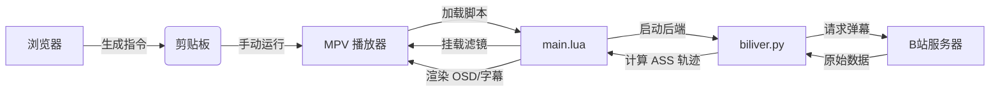

# Biliver 项目实现逻辑与方法说明

本文档详细描述了 Biliver 插件的具体实现细节，旨在为开发者或 AI 助手提供项目架构的深度理解。

## 1. 整体架构 (Overall Architecture)

Biliver 采用 **前端解析 -> 指令传递 -> 播放器逻辑 -> 后端处理 -> 画面渲染** 的闭环架构。

- **前端 (Frontend)**: `biliverhelper.js` (轻量化 Tampermonkey 脚本)
- **播放器逻辑 (Player Logic)**: `main.lua` (MPV 脚本)
- **后端 (Backend)**: `biliver.py` (Python 异步处理进程)
- **配置文件**: `biliver.conf` (用户自定义参数)

---

## 2. 前端解析层 (`biliverhelper.js`)

该组件负责从 Bilibili 页面提取播放所需的所有元数据，并生成一键启动指令。

### 核心逻辑：
- **SPA 适配**: B 站是单页应用 (SPA)，脚本通过 `History API` 钩子和 `setInterval` 轮询检测 URL 变化。
- **按需显示**: 只有在检测到有效的视频/直播页面，且 API 成功返回 `aid/cid` 后，才会在左下角显示 MPV 启动按钮。
- **CDN 提取**: 
    - **点播**: 优先获取 DASH 流（音画分离，支持高码率/4K/HDR）。
    - **直播**: 解析 `playUrl` 接口，提取原画直播流。
- **防 403 机制**: 生成指令时显式包含 `Origin` 和 `Referer` 头。B 站 CDN 强制校验 `Origin: https://www.bilibili.com`。
- **状态注入**:
    - `biliver_enabled=yes`: 激活 Lua 插件。
    - `cid` / `biliver_room_id`: 传递给后端用于拉取弹幕。
    - `--start`: 同步网页当前的播放时间进度。

---

## 3. 播放器逻辑层 (`main.lua`)

该组件监控 MPV 状态，并确保弹幕渲染的平滑度。

### 核心方法：
- **60FPS 补帧 (fps_vf)**: 
    - 针对低于 59fps 的视频，自动挂载 `vf=fps=60:round=near` 滤镜。
    - 确保即使在 24fps 的视频上，ASS 弹幕也能以 60fps 的物理刷新率平滑移动。
- **参数传递**: 将 `biliver.conf` 中的 `duration` (弹幕飞行时间) 传递给 Python 后端，实现全链路速度同步。
- **样式统一**: 通过 `DanmakuManager` 动态生成的 ASS 标签，移除了边框 (`\bord0`) 和阴影 (`\shad0`)，实现极简视觉风格。
- **进程管理**: 为每个播放实例分配独立的 IPC 管道，防止多实例冲突。

---

## 4. 后端处理层 (`biliver.py`)

这是一个独立的异步进程，负责弹幕协议解析和运动轨迹计算。

### 实现方法：
- **VOD 弹幕运动模型**:
    - 使用 `DanmakuManager` 管理垂直轨道（Tracks）。
    - **速度计算**: $v = (video\_width + content\_width) / duration$。
    - **碰撞检测**: 基于弹幕长度和飞行速度，计算下一条弹幕进入轨道的安全时间点，彻底解决弹幕重叠问题。
- **Live 弹幕实时化**:
    - 建立 WebSocket 连接，处理 `Brotli` 压缩的 Protobuf 包。
    - 解析 `DANMU_MSG` 消息，根据用户设置调整透明度 (`\alpha`)。
- **透明度处理**: 弃用 `\1a` 标签，改用 `\alpha&H<XX>&` 标签，实现真正的像素级透明，避免变灰问题。

---

## 5. 关键方法索引

### `biliverhelper.js`:
- `detectAndShow()`: 智能页面检测与按钮显示。
- `getDash(aid, cid)`: 获取音画分离的 4K 视频流。
- `buildMpvCommand(media)`: 组装包含完整 HTTP Headers 的命令行。

### `main.lua`:
- `update_fps_vf()`: 动态 FPS 监测与滤镜切换逻辑。
- `mp.observe_property("container-fps", ...)`: 响应式补帧触发。

### `biliver.py`:
- `DanmakuManager.get_track(msg_len)`: 轨道分配与碰撞规避算法。
- `BiliBiliClient._on_danmaku()`: 直播弹幕实时解析回调。

---

## 6. 数据流向

